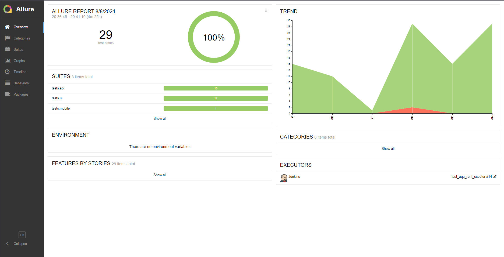
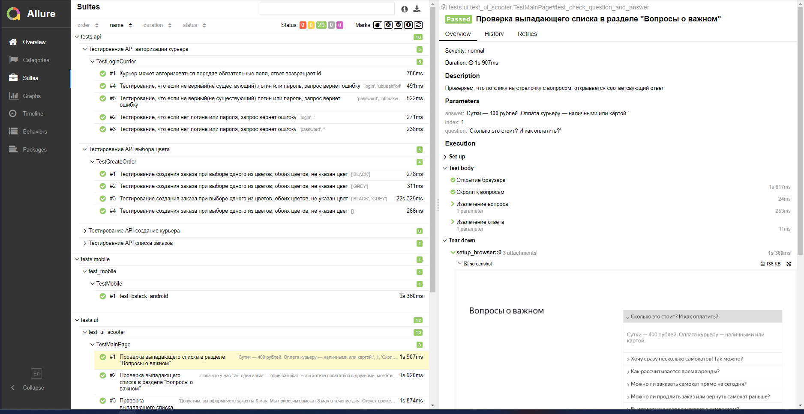
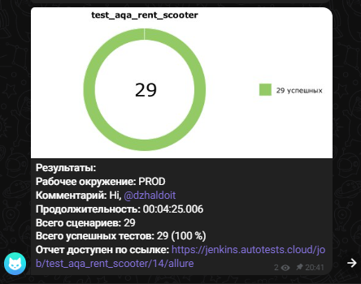
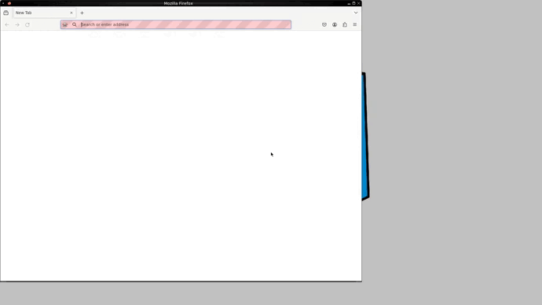
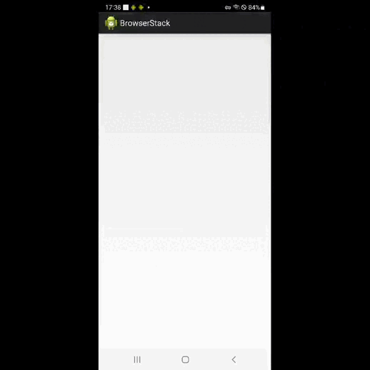
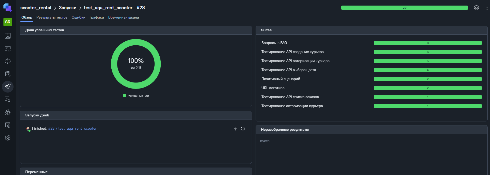
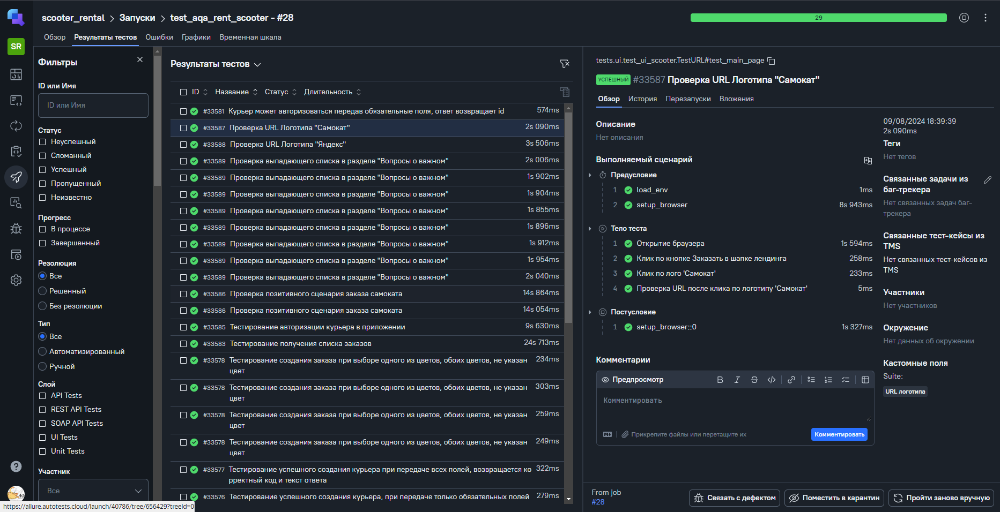
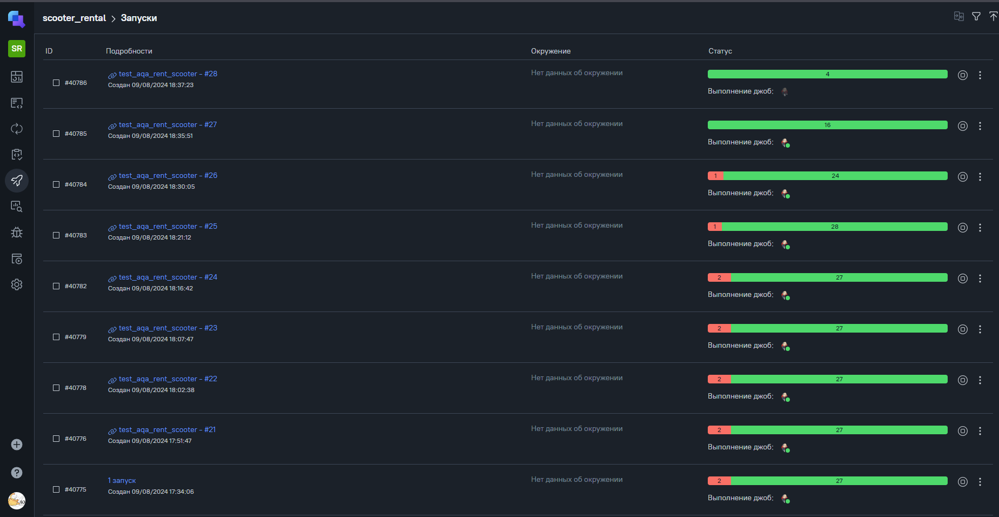

<p align="center">
  <a href="https://scooter-rental.ru/">
    <picture>
      
    </picture>
  </a>
</p>
<h1 align="center">
  Scooter rental
</h1>

<p align="center">
Кикшеринг — краткосрочная аренда электросамокатов. Сервис прижился в России, и теперь почти в каждом городе, даже небольшом, можно взять электросамокат в аренду. Сезон кикшеринга начинается приблизительно с апреля и продолжается вплоть до ноября. В общем, пока позволяет погода и асфальтовое покрытие.

## Используемые инструменты в проекте
           
----
----
<details>
<summary><span style="font-size:1.8em;"><b>Структура проекта</b></span></summary>

``` 
aqa_scooter_rental  - Основной каталог модулей
resources           - Каталог с ресурсами(конки, скриншоты, gif)
data                - Каталог с тестовыми данными для тестов
helpers             - Вспомогательные фикстуры для API
project             - Фцнкции для запусков теста
tests               - Каталог с тестами
pytest.ini          - Файл с настройками тестирования
scooter-v2.0        - APK файл для Android
requirements.txt    - Файл с требованиями к проекту
```
</details>

----

## Список проверок:
* UI Тесты
    - :white_check_mark: Проверка позитивного сценария заказа самоката
    - :white_check_mark: Проверки выпадающего списка в разделе "Вопросы о важном"
    - :white_check_mark: Проверка URL Логотипа "Самокат"
    - :white_check_mark: Проверка URL Логотипа "Яндекс"
* API Тесты
    - :white_check_mark: Тестирование API создание курьера
    - :white_check_mark: Тестирование API выбора цвета
    - :white_check_mark: Тестирование API списка заказов
    - :white_check_mark: Тестирование API авторизации курьера
* Mobile Тесты
    - :white_check_mark: Проверка входа в аккаунт

----
###  Локальный запуск
> Для локального запуска с дефолтными значениями необходимо выполнить команду:
#### 1. Склонировать репозиторий
```
git clone https://github.com/dzhaldoit/aqa_scooter_rental.git
```
#### 2. Запуск
```
python -m venv .venv
source .venv/bin/activate
pip install -r requirements.txt
pytest tests
```
<details>
<summary>В консоле можно изменить параметры запуска, запуск тестов зависит от написания наименований папки для запуска.</summary>

tests\api - Запуск только API тестов.<br>
tests\ui - Запуск только UI тестов.<br>
tests\mobil - Запуск только MOBILE тестов.<br>
tests        - Запуск API/UI/MOBILE тестов.
<br>
</details>

#### ⚠️Важно для запуска Mobile
```
tests\mobile - Запуск только MOBILE тестов.
tests        - Запуск API/UI/MOBILE тестов.

При выборе этих параметров запуска нужно выбрать среду запуска теста:

--context=bstack          - Значение по умолчанию запустится на browserstack
--context=local_emulator  - Эмулятор
--context=local_real      - Реуальное устройство

Пример:

pytest tests\mobile --context=local_emulator - Запустится тесты среды Эмулятора
```


----
###  Удаленный запуск автотестов выполняется на сервере Jenkins
> <a target="_blank" href="https://jenkins.autotests.cloud/job/test_aqa_rent_scooter/">Ссылка на проект в Jenkins</a>

#### Параметры сборки
* `TESTS_TYPE`  - Выбор теста api/ui/mobile сборки
* `comment`     - Комментарий
* `ENVIRONMENT` - Выбор среды запуска теста


####  Для запуска автотестов в Jenkins

1. Открыть <a target="_blank" href="https://jenkins.autotests.cloud/job/test_aqa_rent_scooter/">проект</a>
2. Выбрать пункт `Build with Parameters`
3. Указать TESTS_TYPE сборки
4. Указать CONTEXT для сборки
5. Указать комментарий
6. Указать ENVIRONMENT для сборки
7. Нажать кнопку `Build`
8. Результат запуска сборки можно посмотреть в отчёте Allure/TestOps

----
###  Allure отчет тестов


<details><summary>Общие результаты</summary>
  

</details>

<details><summary>Список тест кейсов</summary>
  

</details>

<details><summary>Пример Telegram отчета</summary>
  

</details>

<details><summary>Пример видео отчета о прохождении ui-теста</summary>
  

</details>

<details><summary>Пример видео отчета о прохождении Mobile-теста</summary>
  

</details>

###  Allure TestOps отчет тестов


<details><summary>Общие результаты</summary>
  

</details>

<details><summary>Список тест кейсов</summary>
  

</details>

<details><summary>История запусков</summary>
  

</details>

